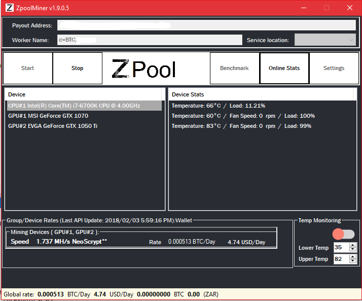

Discussion and Roadmap located at
<a href="https://bitcointalk.org/index.php?topic=2691188" target="_blank">BitcoinTalk Forum</a>

# zPool Miner

- [Introduction](#introduction)
- [What are the benefits?](#benefits)
- [Features](#features)
- [Requirements](#requirements)
- [How to get&run it?](#run)
- [Where is the profit coming from?](#profit)
- [How to run zPool Miner only when profitability is high enough?](#highprofit)
- [Additional options](#options)
- [Troubleshooting](#troubleshooting)
- [How to report bugs and issues?](#bugs)
- [References](#references)

# <a name="introduction"></a> Introduction

zPool Miner is a continuation of Nicehash Miner Legacy. This version is intended for experienced miners who want the quickest updates and highest hashrates.




Please follow us on Twitter <a href="https://twitter.com/MyCryptoCoinz" target="_blank">@MyCryptoCoinz</a> for updates on new versions and other important information.

# <a name="benefits"></a> What are the benefits?

zPool Miner is an advanced auto-miner that supports the latest algorithms and miners. No need to go through tons of configuration files, various mining software versions, configuration tuning or cryptocurrency coins market analysis. **Auto-tuning for best performance and efficiency**, automatic selection and runtime **automatic switching to most profitable cryptocurrency algorithm** are all integrated into zPool Miner and will enable you seamless, joyful and **profitable mining experience**.

# <a name="features"></a> Features

- Easy one-click GPU mining for NVIDIA GPUs using microarchitecture (compute capability) SM 2.1/3.x/5.x/6.x.
- Easy one-click GPU mining for AMD GPUs using any AMD GPU devices that supports OpenCL.
- Integrated support for Simple Multi-Algorithm. Always mine most profitable algorithm. 
- Uses average between 24 HR estimated earnings and 24HR actual earnings In order to minimize switching miner times.
- Integrated benchmarking tool. Run it only once before you start mining and after every hardware/driver/software upgrade.
- Watch-feature - automatically restart miner if crashed or hanged.
- Display current earnings rate in real time.
- Much more...

# <a name="requirements"></a> Requirements

- **Windows** 8.1 or newer operating system **64-bit**
- **[Note: Windows 10 is recommended and will provide you a much better user experience]**
- For AMD mining any AMD GPU with OpenCL support
- For NVIDIA mining any NVIDIA GPU with Compute capability (SM) 2.1 or newer
- **up-to-date patches** for OS
- **up-to-date drivers** for all GPUs
- **Reliable** internet connectivity
- For GPU Mining, **paging file size** of 8GB per GPU.
- Personal **Bitcoin wallet**: https://www.coinbase.com or https://blockchain.info/wallet for those who are new.

# <a name="run"></a> How to get&run it?

All you have to do is download, extract and run the miner (no installation needed), choose the server location that is the **closest to your location**, run built-in benchmark and enter your Bitcoin wallet address where you want to get your coins sent at - and you are ready to start mining and maximizing your profit.

<i>**Note**: .NET Framework 2.0 or higher and Microsoft Visual C++ Redistributable 2013 is required. No additional installations should be needed if you use Windows 8.1 or later. However, if you encounter any issues when starting application (application would fail to start or errors/warnings about missing DLL files are displayed) you should download and install <a href="https://www.microsoft.com/en-us/download/details.aspx?id=30653" target="_blank">Microsoft **.NET Framework 2.0**</a> and <a href="https://www.microsoft.com/en-us/download/details.aspx?id=40784" target="_blank">Microsoft **Visual C++ Redistributable 2013 (vcredist_x64.exe)**</a> (after installation a reboot might be required).</i>

Detailed instructions:
- Download binaries from here: https://github.com/Cryptominer937/zPoolMiner/releases
- Extract zip archive
- Run NiceHashMinerLegacy.exe
- After first run, start benchmark test, otherwise Multi-Algorithm mining will not work properly; for AMD GPUs we suggest you to run **Precise benchmark**
- Make sure you select your own personal Bitcoin wallet to receive payments, see **Bitcoin wallet guidelines and instructions**.
- You will receive Bitcoin payments according to our payments schedule: http://www.zpool.ca/

**WARNING**: Due to specific requirements of the supporting back-end program "sgminer", you can **not** run zPool Miner through Windows RDP (Remote Desktop Protocol) if you are using **AMD GPUs**. If you still wish to use remote access to your computer while running zPool Miner we suggest you to use TeamViewer: https://www.teamviewer.com.

# <a name="profit"></a> Where is the profit coming from?

As a back-end zPool Miner relies on the <a href="http://www.zpool.ca/" target="_blank">zPool.ca</a> service. By running zPool Miner you're Mining one Coin and getting paid in BTC.

# <a name="highprofit"></a> How to run zPool Miner only when profitability is high enough?
Profitability of mining can go up and down that may be unprofitable to mine especially places with high electricity cost. By using the "MinimumProfit" settings, zPoolMinerLegacy will stop mining if the current profits are below the minimum amount (in USD). This will help you mine during "profitable" times only.

# <a name="options"></a> Additional options

Click 'Settings' button.

## General settings
Parameter | Range | Description
-----------------|----------|-------------------
ConfigFileVersion | Version | This is to identify which version of zPoolMinerLegacy did the config file is made from.
Language | number | Language selection for zPoolMinerLegacy GUI.
DisplayCurrency | valid 3 letter code | Converts to selected currency via http://fixer.io valid options are any supported via fixer.
DebugConsole | true or false | When set to true, it displays debug console.
BitcoinAddress | valid BTC address | The address that zPoolMinerLegacy will mine to.
WorkerName | text | To identify the computer on zPool web UI.
ServiceLocation | number | Used to select the location of the mining server.
HideMiningWindows | true or false | When set to true, sgminer, ccminer and cpuminer console windows will be hidden.
MinimizeToTray | true or false | When set to true, zPoolMinerLegacy will minimize to the system tray.
ForceCPUExtension | 0, 1, 2, 3 or 4 | Force certain CPU extension miner. 0 is automatic, 1 for AVX2, 2 for AVX, 3 for AES and  4 for SSE2.
SwitchMinSecondsFixed | number | Fixed part of minimal time (in seconds) before miner switches algorithm. Total time is SwitchMinSecondsFixed + SwitchMinSecondsDynamic.
SwitchMinSecondsDynamic | number | Random part of minimal time (in seconds) before miner switches algorithm. Total time is SwitchMinSecondsFixed + SwitchMinSecondsDynamic. Random part is used to prevent all world-wide zPool Miner users to have the exact same switching pattern.
SwitchMinSecondsAMD | number | Fixed part of minimal time (in seconds) before miner switches algorithm (additional time for AMD GPUs). Total time is SwitchMinSecondsFixed + SwitchMinSecondsAMD + SwitchMinSecondsDynamic.
MinerAPIQueryInterval | number | Amount of time between each API call to get the latest stats from miner.
MinerRestartDelayMS | number | Amount of time to delay before trying to restart the miner.
BenchmarkTimeLimits\CPU | numbers | List of benchmarking time (in seconds). The first one is for "Quick benchmark", second one is for "Standard benchmark" and third one is for "Precise benchmark".
BenchmarkTimeLimits\NVIDIA | numbers | List of benchmarking time (in seconds). The first one is for "Quick benchmark", second one is for "Standard benchmark" and third one is for "Precise benchmark".
BenchmarkTimeLimits\AMD | numbers | List of benchmarking time (in seconds). The first one is for "Quick benchmark", second one is for "Standard benchmark" and third one is for "Precise benchmark".
DeviceDetection\DisableDetectionNVidia6X | true or false | Set it to true if you would like to skip the detection of NVidia6.X GPUs.
DeviceDetection\DisableDetectionNVidia5X | true or false | Set it to true if you would like to skip the detection of NVidia5.X GPUs.
DeviceDetection\DisableDetectionNVidia3X | true or false | Set it to true if you would like to skip the detection of NVidia3.X GPUs.
DeviceDetection\DisableDetectionNVidia2X | true or false | Set it to true if you would like to skip the detection of NVidia2.X GPUs.
DeviceDetection\DisableDetectionAMD | true or false | Set it to true if you would like to skip the detection of AMD GPUs.
AutoScaleBTCValues | true or false | Set it to true if you wish to see the BTC values autoscale to the appropriate scale.
StartMiningWhenIdle | true or false | Automatically start mining when computer is idle and stop mining when computer is being used.
MinIdleSeconds | number | When StartMiningWhenIdle is set to true, MinIdleSeconds tells how many seconds computer has to be idle before mining starts.
LogToFile | true or false | Set it to true if you would like zPoolMinerLegacy to log to a file.
LogMaxFileSize | number | The maximum size (in bytes) of the log file before roll over.
ShowDriverVersionWarning | true or false | Set to true if you would like to get a warning if less than ideal driver for mining is detected.
ShowInternetConnectionWarning | true or false | Set to true if you would like to get a warning if the internet connection is not available.
DisableWindowsErrorReporting | true or false | Set it to true if you would like to disable windows error reporting. This will allow zPoolMinerLegacy to restart the miner in the case of the miner crashes.
UseNewSettingsPage | true or false | Set to true if you would like to use the new Settings form.
NVIDIAP0State | true or false | When set to true, zPoolMinerLegacy would change all supported NVidia GPUs to P0 state. This will increase some performance on certain algorithms.
ethminerDefaultBlockHeight | number | A fallback number that will be used if API call fails. This is only used for benchmarking.
EthminerDagGenerationType | 0, 1, 2, 3 | Set ethminer DAG mode generation 0 - SingleKeep, 1 - Single, 2 - Sequential, 3 - Parallel.
ApiBindPortPoolStart | number | Set the starting value (default is 5100) for miners API ports. When a new miner is created it will use an avaliable API port starting from the ApiBindPortPoolStart and higher.
MinimumProfit | number | If set to any value more than 0 (USD), zPoolMinerLegacy will stop mining if the calculated profit falls below the set amount.
LastDevicesSettup | device settup list | This list is used for setting if a device is enabled or disabled.
LastDevicesSettup\Enabled | true or false | Set to false if you would like to disable this device for benchmarking and mining by zPoolMinerLegacy.
LastDevicesSettup\UUID | text | Used for unique identification purposes in the config file (**DO NOT EDIT**)
LastDevicesSettup\Name | text | Used for identification purposes in the config file (**DO NOT EDIT**)

## Benchmark settings (per device)
Parameter | Range | Description
-----------------|----------|-------------------
DeviceUUID | text | Used for unique identification purposes in the config file (**DO NOT EDIT**)
DeviceName | text | Used for identification purposes in the config file (**DO NOT EDIT**)
AlgorithmSettings | dictionary {key: text, value: Algorithm } | Key value paired dictionary with avaliable device algorithms settings. Keys should not be edited only Algorithm data.
AlgorithmSettings\Algorithm\zPoolID | number | Algorithm ID (**DO NOT EDIT**)
AlgorithmSettings\Algorithm\MinerName | text | specific miner name setting (**DO NOT EDIT**)
AlgorithmSettings\Algorithm\BenchmarkSpeed | number | Fine tune algorithm ratios by manually setting benchmark speeds for each algorithm.
AlgorithmSettings\Algorithm\ExtraLaunchParameters | text | Additional launch parameters when launching miner and this algorithm.
AlgorithmSettings\Algorithm\Intensity | number | Set algorithm Intensity setting for this algorithm (**Setting works only for supported NVIDIA miners**).
AlgorithmSettings\Algorithm\LessThreads | 0 .. 64 | Reduce number of threads used on CPU by LessThreads (**Setting works only on CPU miners**).
AlgorithmSettings\Algorithm\Skip | true or false | Set to true if you would like to skip & disable a particular algorithm. Benchmarking as well as actual mining will be disabled for this particular algorithm. That said, auto-switching will skip this algorithm when mining will be running.

Examples:
--------
If your CPU has 8 virtual cores and you would like to mine only with 7:
> Set LessThreads to 1.

# <a name="troubleshooting"></a> Troubleshooting

My NVIDIA video card(s) is/are not detected.
> Make sure to install latest official NVIDIA drivers from here: 
http://www.nvidia.com/Download/index.aspx
> Also check whether your card has Compute capability (version) 2.1, 3.x or 5.x, check here: https://en.wikipedia.org/wiki/CUDA#GPUs_supported

My AMD video card(s) is/are not detected.
> Make sure to install latest official AMD drivers from here:
http://support.amd.com/en-us/download
> Also check whether your card supports OpenCL, check "OpenCL" column here: https://en.wikipedia.org/wiki/List_of_AMD_graphics_processing_units

I am having issues with my AMD GPU drivers.
> We recommend you to use 15.7.1 version of AMD GPU display drivers. The latest Crimson drivers are also supported, but optimal speed for the majority of algorithms can be achieved by using 15.7.1 version. This version can be <a href="http://support.amd.com/en-us/download/desktop/legacy?product=legacy3&os=Windows+7+-+64" target="_blank">downloaded here</a>.
When uninstalling or reinstalling display drivers we suggest you to use Guru 3D Display Driver Uninstaller. This utility will make sure you get a clean driver state. You can <a href="http://www.guru3d.com/files-details/display-driver-uninstaller-download.html" target="_blank">download it here</a>.
If you are using Windows 10, the AMD installer utility is sometimes unable to install drivers, therefore you have to install them manually. Download and run diver installer, let it extract the archive and then cancel it when prompted to execute actual install. After this go to Control Panel / System / Device Manager, Right click on your GPU, choose to Update driver manually and point to c:\AMD\[driver version] folder to finish the manual driver installation.

I'm getting "Always ask before opening this file" when running zPool Miner
> Make sure you un-check the checkbox "Always ask before opening this file" when zPool Miner is starting cpuminer, ccminer or sgminer back-end programs. This is needed because back-end programs will be executed several times while zPool Miner is running (auto-switching according to profitability and in case programs hangs) and you have to make sure these programs will be to executed automatically without your intervention.

Google Chrome is blocking the download of the application
> Google Chrome falsely flags zPool Miner as a potentially unwanted program and thus prevents you from saving the program archive on your computer. This is an issue with Google Chrome and not with zPool Miner. Use another browser such as Firefox or Edge to download the file instead. Also, read 'My anti-virus is blocking the application' below.

My anti-virus is blocking the application
> Some anti-virus software might block zPool Miner as well as supporting back-end programs (cpuminer, ccminer, sgminer) due to false-positive matches. All software, included into zPool Miner has been verified and checked by our team and is absolutely virus/trojan free. Our service is well established and trusted among users, therefore you can fully trust software releases that are downloaded from our GitHub repository: https://github.com/Cryptominer937/zPoolMiner/releases. However, make sure you **never download and run any files from other unknown sources**! If you downloaded the software package from our GitHub repository you can simply resolve the issues with false-positives by adding the files sgminer.exe, ccminer_sp.exe, ccminer_tpruvot.exe, cpuminer_x64_AVX.exe, cpuminer_x64_AVX2.exe and cpuminer_x64_SSE2.exe to anti-virus exception list.

I'm getting "Enqueueing kernel" errors on AMD GPUs
> If you have very low amount of system memory (RAM), especially if lower than 4 GB, than you might encounter this kind of errors:

```
Error -4: Enqueueing kernel onto command queue. (clEnqueueNDRangeKernel)
GPU 0 failure, disabling!
```

> This is because the sgminer mining application, which is used for AMD GPU mining, requires a particular amount of free system memory (RAM) to be able to run successfully. We suggest you to upgrade your system with more RAM.

My benchmarking results are not accurate
> Any kind of automation can only be done up to a particular level. We've spent significant effort to make benchmarking as good as possible, but it can't be made ideal. First of all, make sure to run Precise benchmark if Standard benchmark is not giving you satisfactory results. If you still see a deviation of actual mining speed from the one, calculated from benchmark, then you should manually enter these observed speed numbers from actual mining into config.json file or set them via the "Settings" button.

Benchmarks on particular algorithms keep getting terminated on AMD GPUs
> In some particular combinations of Windows version + AMD Driver version benchmarks on some algorithms keep getting terminated. If the particular algorithm that is being terminated is shown on pause on the front page of zPool.com (No orders - mining unavailable), then this is normal expected behaviour. However, if benchmark is also terminated for active algorithms, then you have to apply workaround solution. The solution is to copy all .cl files from the [..\bin\sgminer-5-3-0-general\kernel] folder into [c:\Users\[your_username_here]\appdata\local\temp\] folder and then re-run the benchmark for the algorithms that are terminated during benchmark.

# <a name="bugs"></a> How to report bugs and issues?

To report bugs and issues please use the GitHub issue reporting tool: https://github.com/Cryptominer937/zPoolMiner/issues. Any bugs and issues reports are very much appreciated since it helps us to improve zPool Miner. Thank you.

# <a name="references"></a> References

- For CPU mining our joblo's forked cpuminer-opt has been used from here: https://github.com/nicehash/cpuminer-opt (compiled with MingW64).
- For NVIDIA 2.1, 3.x, 5.x and 6.x cryptonight mining our tsiv's forked ccminer-cryptonight has been used from here: https://github.com/nicehash/ccminer-cryptonight
- For NVIDIA 5.x and 6.x cards, sp's fork of ccminer has been used from here: https://github.com/sp-hash/ccminer.
- For NVIDIA 2.1 and 3.x (older cards), tpruvot's fork of ccminer has been used from here: https://github.com/tpruvot/ccminer.
- Special Decred ccminer forked from tpruvot's ccminer has been used from here: https://github.com/nicehash/ccminer-tpruvot.
- Optimized Lyra2REv2 ccminer developed by Nanashi Meiyo-Meijin: https://github.com/nicehash/ccminer-nanashi.
- For AMD cards, sgminer has been used from here: https://github.com/nicehash/sgminer.
- For Ethereum miner, Genoil's fork of ethminer has been used from here: https://github.com/nicehash/cpp-ethereum.
- Optimized SIA ccminer developed by KlausT: https://github.com/KlausT/ccminer.
